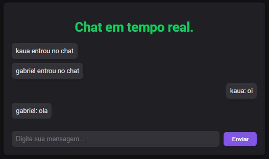

# Chat em Tempo Real



Um aplicativo de chat em tempo real desenvolvido com Node.js e Socket.IO, permitindo comunicação instantânea entre múltiplos usuários.

## Tecnologias Utilizadas

- **Backend**: Node.js, Express, Socket.IO
- **Frontend**: HTML5, CSS3, JavaScript

## Instalação

1. Clone este repositório:

```
git clone https://github.com/seu-usuario/chat-realtime.git
cd chat-realtime
```

2. Instale as dependências:

```
npm install
```

## Como Executar

Inicie o servidor:

```
node server.js
```

Acesse o aplicativo no navegador:

```
http://localhost:3000
```

## Funcionalidades

- Chat em tempo real entre múltiplos usuários
- Interface simples e responsiva
- Notificações de entrada e saída de usuários
- Visualização de usuários online

## Estrutura do Projeto

```
├── package.json      # Dependências e scripts do projeto
├── server.js         # Servidor Node.js e configuração do Socket.IO
└── public/           # Arquivos estáticos
    ├── index.html    # Interface do usuário
    ├── script.js     # Lógica do cliente
    └── style.css     # Estilos da aplicação
```
